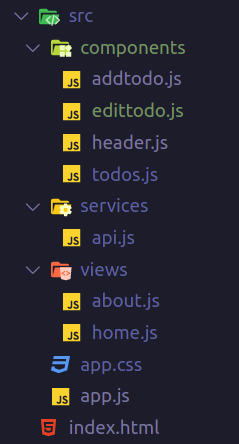

# Spk.js
> A simple light weight library for providing spa experience.

*If you know vanilla js then this library is for you*

# Features
* Routing
* Reusable Components
* State Management System
* Coding via Vanilla

# Ecosystem
* Extensions
  * HTML syntax highlighter [Market Place](https://marketplace.visualstudio.com/items?itemName=Tobermory.es6-string-html)
  * CSS syntax highlighter [Market Place](https://marketplace.visualstudio.com/items?itemName=jpoissonnier.vscode-styled-components)

---
* SOON
  * vscode extension with syntax highlighter and code snippets
  * chrome devtools showing the app tree

---
### INSTRUCTIONS
1. If there is a component that will be manipulated for example via (innerHTML, append(), prepend() and insertAdjacentHTML and so on) then you gotta disable component scoping

### Router
```javascript
import { Router } from "spk.js";
// views
import Home from "./views/home.js";
import About from "./views/about.js";

const router = new Router({
  mode: "history",
  root: "/",
  el: "#app",
});

router
  .add("/", Home)
  .add("/about", About);
```

---

### Component Structure
```javascript
import { html, css, OnInit } from "../../lib/spk.js";
import Header from "../components/header.js";

let template = html`
  <div id="home">
    <header />
  </div>
`;

export default class Home extends OnInit {
  data = {
    name: "Home",
    components: {
      Header
    },
    template,
    style,
    render: () => this.render(),
    scoped: true,
  };

  constructor() { super(); }
  init = () => super.init(this.data);

  render() {
    console.log("test from home component");    
  }

}

let style = css`
  #home {}
`;
```
---

### Shared Service (State Management System)
```javascript
class Service {
  todos = [];

  constructor() {
    this.stateUpdated = new Event(`${new Date().getTime()}`);
    this.event = this.stateUpdated.type;
  }

  add(todo) {
    this.todos.push(todo);
    this.trigger();
  }

  trigger() {
    dispatchEvent(this.stateUpdated);
  }
}

export const service = new Service();
```
---

### A Component Stores Data in the Shared Service
```javascript
import { html, css, OnInit } from "spk.js";
import { api } from "../services/api.js";

let template = html`
  <div id="addtodo"></div>
`;

export default class AddTodo extends OnInit{
  data = {
    name: "AddTodo",
    template,
    style,
    render: () => this.render(),
    scoped: true,
  }
  constructor() { super(); }
  init = () => super.init(this.data);

  render() {
    api.add({ title: "test title", id: 1});
  }

}

let style = css`
  #addtodo {}
`;
```
---

### A Component Receives Data from the Shared Service
```javascript
import { html, css, OnInit } from "spk.js";
import { api } from "../services/api.js";

let template = html`
  <div id="todos"></div>
`;

export default class Todos extends OnInit {
  data = {
    name: "Todos",
    template,
    style,
    render: () => this.render(),
    scoped: false,
  };

  constructor() { super(); }
  init = () => super.init(this.data);

  render() {
    on(api.event, () => console.log(api.get()));
    api.trigger();
  }

}

let style = css`
  #todos {}
`;

```

---

### index.html 

```html
<!DOCTYPE html>
<html lang="en">
  <head>
    <meta charset="UTF-8" />
    <meta name="viewport" content="width=device-width, initial-scale=1.0" />
    <title>Spk</title>
    <link rel="stylesheet" href="src/app.css">
    <script defer type="module" src="src/app.js"></script>
  </head>

  <body>
    <div id="app"></div>
  </body>
</html>
```

---

### Project Structure


# Getting Started
*clone the project and open index.html via a live server*