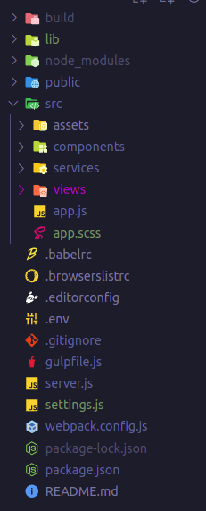

<p align="center"></p>

# PKjs

A simple lightweight library for providing SPA experience.

Do you want to build web apps with just knowing vanilla javascript and get almost the same results as SPA frameworks!

* PKjs is built for ignoring anything but vanilla javascript.

# Features
* Routing
* Reusable Components
* State Management System
* Coding via Vanilla Javascript

# Ecosystem
* Extensions
  * HTML syntax highlighter [Market Place](https://marketplace.visualstudio.com/items?itemName=Tobermory.es6-string-html)
  * CSS syntax highlighter [Market Place](https://marketplace.visualstudio.com/items?itemName=jpoissonnier.vscode-styled-components)

* SOON
  * vscode extension with syntax highlighter and code snippets
  * chrome devtools showing the app tree

---
# INSTRUCTIONS
1. If there is a component that will be manipulated for example via (innerHTML, append(), prepend() and insertAdjacentHTML and so on) then you gotta disable component scoping

### Router
```javascript
import { Router } from "pk.js";
// views
import Home from "./views/home.js";
import About from "./views/about.js";
import NotFound from "./views/notfound";

export const router = new Router({
  mode: "history",
  root: "/",
  el: "#app",
});

router
  .add("/", Home)
  .add("/about", About)
  .add("/404", NotFound);
```

---

### Component Structure
```javascript
import { html, css, OnInit } from "pk.js";
import Header from "../components/header.js";

let template = html`
  <div id="home">
    <header />
  </div>
`;

export default class Home extends OnInit {
  data = {
    name: "Home",
    components: {
      Header
    },
    template,
    style,
    render: () => this.render(),
    scoped: true,
  };

  constructor() {
    super();
  }

  init = () => super.init(this.data);

  render() {
    console.log("test from home component");
  }
}

let style = css`
  #home {}
`;

```
---

### Shared Service (State Management System)
```javascript
class Service { 
  todos = [];
  temp = null

  constructor() {
    this.stateUpdated = new Event(`${new Date().getTime()}`);
    this.event = this.stateUpdated.type;
  }

  add(todo) {
    this.todos.push(todo);
    this.trigger();
  }

  trigger() {
    dispatchEvent(this.stateUpdated);
  }
}

export const api = new Service();
```
---

### A Component Stores Data in the Shared Service
```javascript
import { html, css, $, OnInit } from "pk.js";
import {api} from "../services/api.js";

let template = html`
  <div id="addtodo">
    <form>
      <input type="text" placeholder="Enter Todo..." />
      <button type="submit">add</button>
    </form>
  </div>
`;

export default class AddTodo extends OnInit {
  data = {
    name: "AddTodo",
    template,
    style,
    render: () => this.render(),
    scoped: true,
  }
  constructor() {
    super();
  }

  init = () => super.init(this.data);

  render() {
    console.log("test from addtodo component");
    const form = $("#addtodo form");
    const input = $("#addtodo input");

    form.on("submit", (e) => {
      e.preventDefault();
      const value = input.value.trim();
      const todo = { title: value, id: new Date().getTime() };
      api.add(todo);
    });
  }
}

let style = css`
  #addtodo {}
`;
```
---

### A Component Receives Data from the Shared Service
```javascript
import { html, css, $, OnInit, debug } from "pk.js";
import { api } from "../services/api.js";

let template = html`
  <div id="todos">
    <ul></ul>
  </div>
`;

export default class Todos extends OnInit {
  data = {
    name: "Todos",
    template,
    style,
    render: () => this.render(),
    scoped: false,
  };

  constructor() {
    super();
  }

  init = () => super.init(this.data);

  render() {
    console.log("test from todos component");

    this.onChange();
  }

  onChange() {

    addEventListener(api.event, () => {
      const todos = api.get();
      const ul = $("#todos ul");
      if (ul) {
        ul.innerHTML = todos
          .map(todo => {
            return `
              <li>
                <p>${todo.title}</p>
                <span class="editBtn" data-id="${todo.id}">&#9998;</span>
                <span class="deleteBtn" data-id="${todo.id}">&#10006;</span>
              </li>
              `;
          })
          .join("");
      }
    });

    api.trigger();
  }

}

let style = css`
  #todos {}
`;

```

---

### index.html 

```html
<!DOCTYPE html>
<html lang="en">
  <head>
    <meta charset="utf-8" />
    <meta http-equiv="X-UA-Compatible" content="IE=edge" />
    <meta name="viewport" content="width=device-width,initial-scale=1.0" />
    <title><%= htmlWebpackPlugin.options.title %></title>
  </head>

  <body>
    <noscript>
      We're sorry but
      <strong><%= htmlWebpackPlugin.options.title %></strong>
      doesn't work properly without JavaScript enabled. Please enable it to continue.
      <br />
      <strong>
        Here are the
        <a href="https://www.enablejavascript.io/" target="_blank">instructions, how to enable JavaScript in your web browser</a>
      </strong>
    </noscript>

    <div id="app"></div>
  </body>
</html>
```

---

### Project Structure


# Get Started

### Dev Server
```bash
npm run dev
```

### Build for pProduction
```bash
npm run build
```