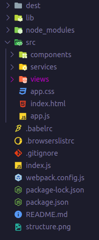

# Spk.js
> A simple light weight library for providing spa experience.

*If you know vanilla js then this library is for you*

# Features
* Routing
* Reusable Components
* State Management System

# Ecosystem
* Extensions
  * HTML syntax highlighter [Market Place](https://marketplace.visualstudio.com/items?itemName=Tobermory.es6-string-html)
  * CSS syntax highlighter [Market Place](https://marketplace.visualstudio.com/items?itemName=jpoissonnier.vscode-styled-components)

---

### Router
```javascript
import { Router, spk } from "../lib/spk.js";
// views 
import Home from "./views/home.js";
import About from "./views/about.js";

const router = new Router({
  mode: "history",
  root: "/",
});

router
  .add("/", () => spk.methods.component(Home))
  .add("/about", () => spk.methods.component(About));
```

---

### Component Structure
```javascript
import { spk, debug, html, css } from "../../lib/spk.js";
import Header from "../components/header.js";

let template = html`
  <div id="home">
    <header />
  </div>
`;

export default class Home {
  components = { Header };

  init(ob = spk.methods.scoped(template, style)) {
    eval(spk.data.init);
    return ob;
  }

  render() {
    debug("Home Component Works!");
  }
}

let style = css`
  #home {

  }
`;
```

---

### Shared Service (State Management System)
```javascript
class Service {
  todos = [];

  constructor() {
    this.stateUpdated = new Event(`${new Date().getTime()}`);
    this.event = this.stateUpdated.type;
  }

  add(todo) {
    this.todos.push(todo);
    this.trigger();
  }

  trigger() {
    dispatchEvent(this.stateUpdated);
  }
}

export const service = new Service();
```

---
### index.html 

```html
<!DOCTYPE html>
<html lang="en">
  <head>
    <meta charset="UTF-8" />
    <meta name="viewport" content="width=device-width, initial-scale=1.0" />
    <title>Project Name</title>
    <!-- include global style -->
    <link rel="stylesheet" href="src/app.css">
    <!-- include library -->
    <script defer src="lib/spk.js"></script>
    <!-- include app.js -->
    <script defer type="module" src="src/app.js"></script>
  </head>

  <body>
    <!-- inject components here -->
    <div id="root"></div>
  </body>
</html>

```

---

### Project Structure



# Getting Started
*clone the project and open index.html via a live server*